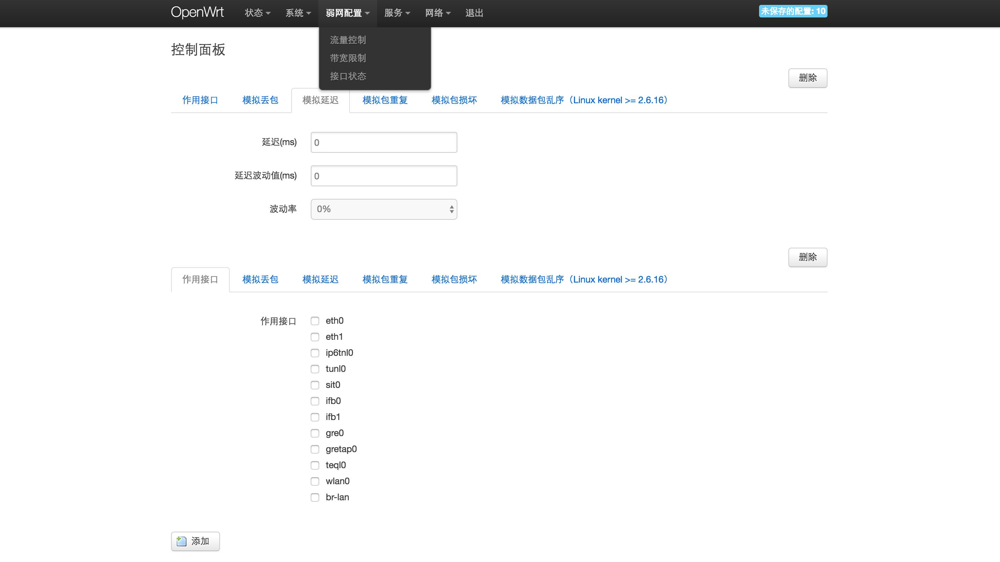

# WeakNetwork
A software package of OpenWrt that can help you to build a perfect weak network environment. (一个方便搭建并配置完美弱网测试环境的软件包。)

因业务需求，笔者需要搭建一个弱网环境，来测试设备在弱网环境下的表现。现在已有一些弱网模拟工具，微软有Network Emulator for Windows Toolkit（NEWT），Facebook有Augmented Traffic Control（ATC），这些方式要么是通过代理，要么就是只能实现wifi丢包，我们需要模拟网口的丢包，因此只能借助于开源的OpenWrt linux系统，调用其tc命令来控制流量，实现丢包、传输延时等。



`dist`目录是笔者编译好的软件包和已经带弱网包的极壹和极三的固件。`luci-app-weaknetwork_1.0-1_all.ipk`弱网模拟软件包与硬件无关，理论上带有netem工具的OpenWrt系统都可以正常安装使用。

## 使用弱网环境包的方式
### 方式一：直接在OpenWrt系统中安装ipk软件包
前提条件：路由器固件需要支持**netem**工具，若安装软件包后操作无效，可以尝试方式二(编译固件)

a) 方式1：在OpenWrt Web管理页面中安装

//需要在系统 --> 软件包 --> 配置，添加包的配置信息，暂时不可用

b) 方式2：使用ssh安装
```
scp luci-app-weaknetwork.ipk root@192.168.1.1:/tmp/uci-app-weaknetwork.ipk
```

进入ssh:
```
cd /tmp
opkg update
opkg install uci-app-weaknetwork.ipk
```

### 方式二：重新编译路由器OpenWrt固件
#### 1. 安装必要工具
```
sudo apt-get install  libncurses5-dev  zlib1g-dev  gawk  flex  patch   git-core g++   subversion
```
#### 2. 把`luci-app-weaknetwork`文件夹整体复制到`你的固件包/openwrt-ar71xx/package`目录下，若没有这个目录，就是`你的固件包/openwrt-ramips/package`下，总是就是OpenWrt存放package软件包的地方。
#### 3. 支持netem工具
修改固件包目录下的一个`config-xxx`的文件（更建议在menuconfig里面修改）并取消前面的注释符：
```
CONFIG_PACKAGE_kmod-netem=y
CONFIG_PACKAGE_kmod-sched-core=y
CONFIG_PACKAGE_kmod-sched=y
```

#### 4. make menuconfig
进入固件包下执行上述命令，看有没有LuCI相关配置，如果没有的话，需要更新一下：

a) 更新openwrt包(luci包等)
```
./scrips/feeds update -a
./scrips/feeds install -a -p
```

也可以只更新luci包：
 
 ```
./scripts/feeds update packages luci
./scripts/feeds install -a -p luci
```

b) 之后按如下方式配置下：
```
Target System (x86)
       Subtarget (Generic)
       Target Profile (Generic)
       Target Image -->
              < > jffs2
              < > squashfs
              < > tgz
              <* > Build VMware image files (VMDK). Requires qemu-img
 
       Network -->
              <*> uhttpd
 
       LuCI -->
          Collections -->
               < * > luci
          Applications-->
              <* > luci-app-ddns
              <* > luci-app-firewall
              <* > luci-app-ntpc
              <* > luci-app-samba
          Themes-->全选
          Translations -->
              <* > luci-i18n-chinese
```

c) 进入`LuCI --> Applications --> luci-app-weaknetwork`,选中

d) 进入`Network --> WebServers/Proxies  --> pdnsd`，一个dns代理服务器，取消该项的选中，可能是由于要翻墙的原因，笔者这里不取消编译不能通过

#### 5.编译
命令行输入`make V=99`（编译时显示详细信息）

#### 6. 刷写固件
```
scp recovery.bin root@192.168.199.1:/tmp/recovery.bin  #拷贝你的固件到此
cd /tmp
sysupgrade -F -n recovery.bin
```

重启，完成！

注：带宽限制需要内核支持CBQ队列，若带宽限制设置无效，可能是当前的内核不支持。


更多相关内容可以查看笔者的[博客](http://lcodecorex.github.io/2016/11/10/%E6%9E%81%E5%A3%B9%20+%20OpenWRT%20+%20tc:netem%20%E6%90%AD%E5%BB%BA%E5%BC%B1%E7%BD%91%E7%8E%AF%E5%A2%83/)。